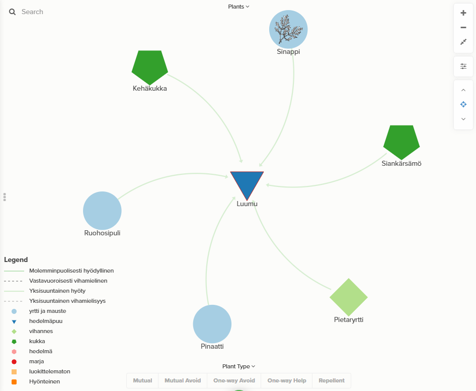
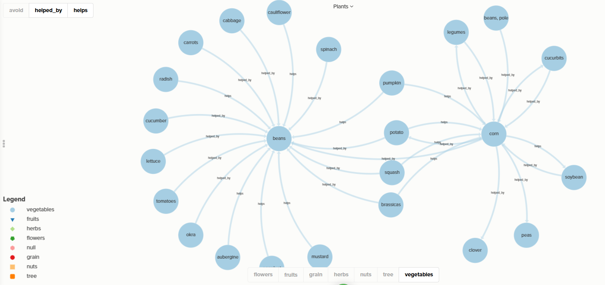

# ActInf Garden 🏡

[Intro video](https://www.canva.com/design/DAG4IHVJsVY/bQN1RVtYTap2IXJ5jgmL1w/watch?utm_content=DAG4IHVJsVY&utm_campaign=designshare&utm_medium=link2&utm_source=uniquelinks&utlId=h70860bf332)

If you want to use TTS to listen to the text in the video, here is the text for the [intro](https://github.com/JanaLumi/ActInf-Garden/blob/main/Intro.md). You can also download the <a href="https://docs.google.com/document/d/1g9nGbBlnCdEwsJA0gmjJQlzQz6VyTj9YF-1WrL4rYqo/edit?tab=t.0">the google doc</a>.

This is a companion planting relational graph with a plum in the centre.

You can explore this<a href="https://embed.kumu.io/aaf4df1ba3ab76a01ccdbefbbca4fc45" target="_blank" rel="noopener" /> relational graph of plants</a>

The plants are in Suomi (Finnish), you might need to use a translator to figure them out. Here is the translation of the legend:

--------------------
LEGEND
--------------------

- Mutually beneficial
- Mutually antagonistic
- One-way beneficial
- One-way antagonistic
- herbs and spice
- fruit trees
- vegetables
- fruit
- berries
- uncategorised
- insects and animals repellent

---------------------------------------------------

If you want to find other examples for the Markov's Garden you can explore this systems map of companion plants put together from Alex's dataset: <a href="https://embed.kumu.io/65475b7c0a6fcccc2aba93cdb4f403fa" target="_blank" rel="noopener" />🌱 Systems Map</a>

Description: This systems map explores the relationships between plants for the purpose of companion planting. When using this map, be sure to do your own research for what is suitable in your area. The dataset is incomplete and has been edited from its source: [Dataset](https://www.kaggle.com/datasets/aramacus/companion-plants/data) published by Alex Kozlov - downloaded 20250312

## Your Turn

Now that you have access to the tools, you can make your way to the [canva playground](https://www.canva.com/design/DAG4cWsNumQ/GpF52KBRqPofRshEqYQYbg/edit?utm_content=DAG4cWsNumQ&utm_campaign=designshare&utm_medium=link2&utm_source=sharebutton).

